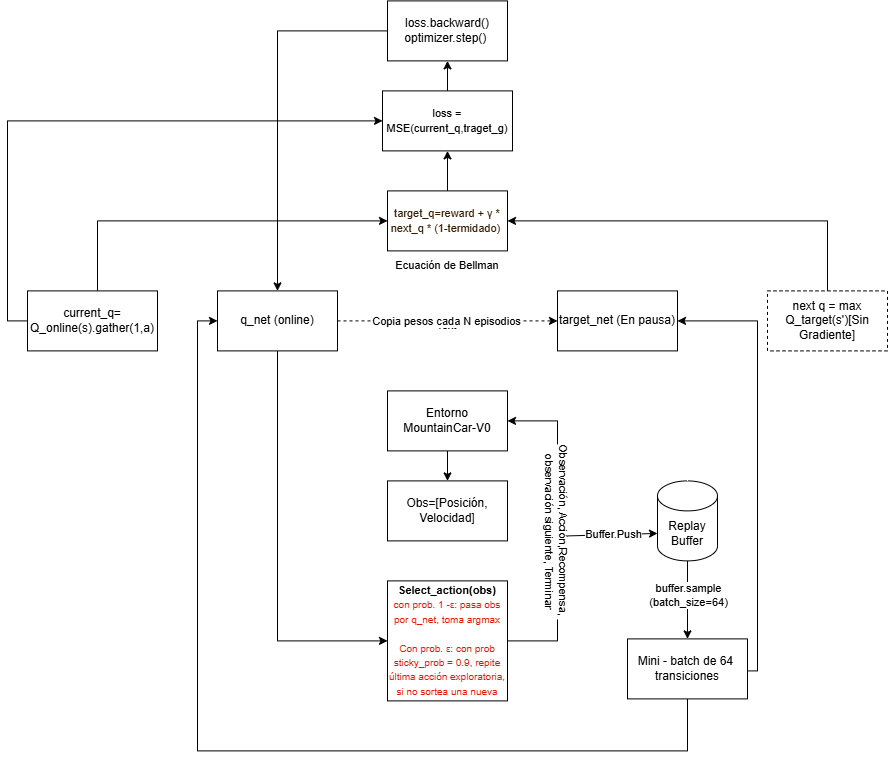

<picture>
  <source media="(prefers-color-scheme: dark)" srcset="resultados/figuras/banner_oscuro.png">
  
</picture>

# MountainCar-v0 con Q-Learning tabular y DQN

[](https://github.com/leonarsomo/mountain_car/actions/workflows/ci.yml)
[](.python-version)
[](LICENSE)
[](CITATION.cff)

**Exploración persistente en un entorno de recompensa plana.** Taller 1 de la Unidad 2, curso Simulación y Aprendizaje por Refuerzo, Maestría en Inteligencia Artificial, Universidad de La Sabana (Chía, Colombia), periodo 2026-2.

Autores: Leonar Socarrás Molina (leonarsomo@unisabana.edu.co), John Jairo Serrano Cifuentes (johnseci@unisabana.edu.co,Brezhnev Joya Miranda (brezhnevjomi@unisabana.edu.co), Gabriel Alonso Lizano Alvarado (gabriellial@unisabana.edu.co), Bryan Johann Aranzazu Medina (bryanarme@unisabana.edu.co) , ORCID [0000-0003-0601-9151](https://orcid.org/0000-0003-0601-9151). Docente: Emilio Muñoz Pérez. Repositorio base: [emiliomunozai/mountain_car](https://github.com/emiliomunozai/mountain_car).

## Resumen

Comparo dos agentes de aprendizaje por refuerzo en MountainCar-v0: Q-Learning tabular sobre una rejilla de 20 × 20 y una Deep Q-Network (DQN) sobre la observación continua. Ambos se entrenaron con semilla fija y se evaluaron en 100 episodios sin exploración, con semillas distintas de las usadas para entrenar y para escoger el punto de control. El agente tabular obtuvo una recompensa media de -123.0 (bandera en 98 de 100 episodios) y DQN de -96.7 (100 de 100), con cerca de nueve veces menos interacción con el entorno. El hallazgo de mayor interés está en la exploración. Con el epsilon-greedy de libro, DQN no aprende nada: en 300 episodios de acciones uniformes la bandera se alcanzó 0 veces, y una red que solo ve recompensas de -1 concluye, con razón, que ninguna acción importa. Sostener la acción exploratoria durante unos 20 pasos (Dabney et al., 2020) resuelve el problema sin tocar la regla de aprendizaje, lo que es legítimo porque Q-learning es off-policy.

**Abstract.** I compare tabular Q-Learning (20 × 20 grid) and a Deep Q-Network on MountainCar-v0 under a fixed-seed protocol with held-out evaluation seeds. Over 100 greedy episodes the tabular agent scores -123.0 (flag reached in 98/100) and DQN scores -96.7 (100/100) using about nine times fewer environment steps. The main finding concerns exploration: with textbook epsilon-greedy, uniform random actions reached the flag 0 times in 300 episodes, so DQN correctly learns that no action matters. Holding each exploratory action for about 20 steps (temporally extended epsilon-greedy) fixes this without changing the learning rule.

**Palabras clave:** aprendizaje por refuerzo, Q-learning, DQN, exploración, recompensa plana, reproducibilidad.

### Los dos agentes entrenados

| Q-Learning tabular: 113 pasos | DQN: 104 pasos |
|:---:|:---:|
|  |  |

Un episodio sin exploración de cada agente, con la misma semilla de inicio. Ambos retroceden primero para tomar impulso.

### Resultados principales

Cloné el repositorio del curso, completé los tres ejercicios que venían como plantillas vacías (`EXERCISES.md`), entrené los dos agentes y dejé aquí el código, los registros y las curvas.

| | Q-Learning tabular | DQN |
|---|---:|---:|
| Recompensa media en evaluación (100 episodios) | -123.0 ± 16.4 | **-96.7 ± 7.6** |
| Episodios que alcanzan la bandera | 98 / 100 | **100 / 100** |
| Mejor y peor episodio de la evaluación | -110 / -200 | -83 / -104 |
| Episodios de entrenamiento | 20 000 | 2 500 |
| Pasos de entorno consumidos | 3 258 421 | 374 135 |
| Supera el umbral convencional de -110 | no | sí |

## Contenido

1. [El problema como proceso de decisión](#1-el-problema-como-proceso-de-decisión)
2. [Cómo ejecutarlo](#2-cómo-ejecutarlo)
3. [Proceso: qué implementé](#3-proceso-qué-implementé)
4. [Esquemas de entrenamiento](#4-esquemas-de-entrenamiento-dibujos-propios)
5. [Mejor resultado de Q-Learning](#5-mejor-resultado-de-q-learning)
6. [Mejor resultado de DQN](#6-mejor-resultado-de-dqn)
7. [Comparación](#7-comparación-y-estrategia-elegida)
8. [Estructura del repositorio](#8-estructura-del-repositorio)
9. [Declaración de uso de IA](#9-declaración-de-uso-de-ia)
10. [Cómo citar](#10-cómo-citar)
11. [Licencia y agradecimientos](#11-licencia-y-agradecimientos)
12. [Referencias](#referencias)

## 1. El problema como proceso de decisión

Un carro con motor débil está en el fondo de un valle y debe llegar a la bandera de la colina derecha. El motor no vence la pendiente, así que la única salida es balancearse para ganar impulso. Sutton y Barto (2018) lo presentan como una tarea de control en la que hay que alejarse de la meta antes de poder acercarse (p. 244). Lo formulo como un MDP episódico con los datos que publica la documentación del entorno (Farama Foundation, 2024):

| Elemento | Definición en MountainCar-v0 |
|---|---|
| Estado *s* | posición *x* ∈ [-1.2, 0.6] y velocidad *v* ∈ [-0.07, 0.07], ambos continuos |
| Acción *a* | 0 empujar a la izquierda, 1 no empujar, 2 empujar a la derecha |
| Transición | *v'* = *v* + (*a* - 1)·0.001 - cos(3*x*)·0.0025 ; *x'* = *x* + *v'*. Es determinista |
| Recompensa | -1 en cada paso, sin excepción |
| Inicio | *x* uniforme en [-0.6, -0.4], *v* = 0 |
| Fin | terminación si *x* ≥ 0.5; truncamiento a los 200 pasos |
| Descuento | γ = 0.99 |

Dos consecuencias gobiernan todo lo que sigue. La primera: como cada paso cuesta -1, el retorno del episodio es el número de pasos con signo negativo, de modo que -200 equivale a no haber llegado nunca y cualquier valor mayor indica que se alcanzó la bandera. La segunda: la recompensa es plana. Nada en ella le dice al agente que se está acercando, y por eso no puede aprender nada hasta que la exploración lo lleva a la bandera por primera vez.

## 2. Cómo ejecutarlo

Requisitos: Python 3.11 y [uv](https://docs.astral.sh/uv/). No hace falta GPU.

```bash
git clone https://github.com/leonarsomo/mountain_car.git
cd mountain_car
uv sync
```

Revisar los agentes ya entrenados, que están versionados en `saves/`:

```bash
uv run mountaincar list
uv run mountaincar load qlearning --eval     # 10 episodios voraces
uv run mountaincar load dqn --eval
uv run mountaincar render dqn --episodes 3   # abre una ventana gráfica
```

Comprobar que todo funciona (unos segundos):

```bash
make pruebas        # o: uv run pytest -q
```

Reproducir el experimento completo desde cero (misma semilla, 7). `make reproducir` ejecuta las cuatro órdenes en orden:

```bash
uv run python scripts/diagnostico_exploracion.py                                  # unos 40 s
uv run python scripts/experimento.py qlearning --episodes 20000 --chunk 500       # 2 a 5 min
OMP_NUM_THREADS=1 uv run python scripts/experimento.py dqn --episodes 2500 --chunk 50   # unos 14 min en CPU
uv run --with matplotlib python scripts/graficar.py    # figuras, tema claro y oscuro
uv run --with pillow python scripts/animar.py          # GIF de cada agente
```

`OMP_NUM_THREADS=1` hace falta. La red es tan pequeña que repartir cada multiplicación entre varios hilos cuesta más que hacerla; en la máquina de la corrida reportada (CPU de 2 núcleos), sin esa variable el entrenamiento de DQN avanzaba a unos 20 episodios por minuto y con ella a unos 180.

También sirve la CLI original (`uv run mountaincar train qlearning --episodes 20000`), con una diferencia: guarda el agente tal como queda en el último episodio. En la sección 5 muestro por qué eso importa.

## 3. Proceso: qué implementé

El repositorio base trae escritos la CLI, los bucles de entrenamiento y la persistencia. Los algoritmos venían como bloques `EXERCISE` que lanzaban `NotImplementedError`. El historial de commits sigue el mismo orden que esta sección.

### 3.1 Q-Learning tabular (`src/mountain_car/agents/qlearning.py`)

**Discretización (1a).** Cada dimensión se parte en 20 intervalos con `np.digitize` sobre los bordes interiores, lo que da una rejilla de 20 × 20 = 400 celdas. La clave de la tabla es la tupla `(i_posición, i_velocidad)`. Como `np.digitize` con bordes interiores devuelve índices entre 0 y 19, un valor fuera de rango cae en la celda extrema y no hace falta recortarlo.

**Tabla Q.** Es un `defaultdict` que entrega un vector de tres ceros para cualquier celda no visitada. Ese cero inicial tiene un efecto que no es evidente: toda recompensa real es negativa, de manera que una acción jamás probada (valor 0) siempre parece mejor que una probada (valor negativo). La tabla explora por optimismo aunque epsilon sea pequeño, algo que Sutton y Barto (2018) señalan para este mismo problema (p. 246).

**Selección de acción (1b).** Epsilon-greedy. Con `deterministic=True` jamás explora, condición de la que dependen la evaluación y el render.

**Actualización (1c).** La regla de Q-learning (Sutton & Barto, 2018, p. 131):

```python
target = reward if terminated else reward + gamma * max(Q[next_state])
Q[state][action] += lr * (target - Q[state][action])
```

El corte del bootstrap usa `terminated` y no `done`. Agotar los 200 pasos es un límite de tiempo impuesto por el entorno y no un estado terminal del MDP; tratarlo como terminal le enseñaría al agente que quedarse sin tiempo cuesta solo -1.

**Hiperparámetros.** Los del repositorio base, sin ajuste: `n_bins=20`, `lr=0.1`, `gamma=0.99`, epsilon de 1.0 a 0.01 con factor 0.9995 por episodio (toca el piso cerca del episodio 9 200).

### 3.2 DQN (`src/mountain_car/agents/dqn.py`)

**Red (2a).** Perceptrón de 2 → 128 → 128 → 3 con ReLU en las capas ocultas y salida lineal, 17 283 parámetros. La salida no lleva activación porque son valores Q, todos negativos en esta tarea.

**Paso de aprendizaje (2b).** Sobre un mini-lote de 64 transiciones tomadas al azar de la memoria:

```python
current_q = q_net(states).gather(1, actions)                       # (B, 1)
with torch.no_grad():
    next_q   = target_net(next_states).max(dim=1, keepdim=True).values
    target_q = rewards + gamma * next_q * (1.0 - terminateds)      # (B, 1)
loss = MSE(current_q, target_q)   # luego zero_grad, backward, step
```

El objetivo sale de la red congelada y sin gradiente. Zhao (2025) explica la razón: el parámetro *w* aparece también dentro del objetivo, y suponerlo fijo durante un tiempo es lo que hace tratable el gradiente (pp. 182-183). Verifiqué que `current_q` y `target_q` tuvieran la misma forma `(64, 1)`, porque una difusión silenciosa de formas entrena sobre basura sin lanzar error.

**Hiperparámetros.** `lr=1e-3` (Adam), `gamma=0.99`, lote de 64, memoria de 100 000 transiciones, sincronización de la red objetivo cada 10 episodios, epsilon de 1.0 a 0.01 con factor 0.995, y el que agregué: `explore_repeat=0.95`.

### 3.3 Por qué DQN no aprendía (Ejercicio 3)

Con los ejercicios 2a y 2b correctos, DQN se quedó clavado en -200. Antes de tocar nada, medí.

*El código de aprendizaje estaba bien.* El mismo agente, con epsilon-greedy de libro, pasa en CartPole-v1 de una recompensa media de 19.8 a 157.4 en 200 episodios (`resultados/registros/dqn_cartpole_control.txt`), así que el problema era propio de MountainCar.

*La exploración uniforme nunca ve la bandera.* `scripts/diagnostico_exploracion.py` juega 300 episodios con acciones al azar y cuenta cuántos terminan. Varié la probabilidad de repetir la acción anterior:

| Probabilidad de repetir | Episodios con bandera | Racha media (pasos) |
|---:|---:|---:|
| 0.00 (epsilon-greedy de libro) | **0 / 300** | 1.5 |
| 0.50 | 0 / 300 | 3.0 |
| 0.80 | 2 / 300 | 7.3 |
| 0.90 | 18 / 300 | 14.1 |
| 0.95 | **32 / 300** | 25.1 |
| 0.98 | 17 / 300 | 47.3 |

<picture>
  <source media="(prefers-color-scheme: dark)" srcset="resultados/figuras/diagnostico_exploracion_oscuro.png">
  
</picture>

Con sorteo independiente en cada paso, la racha media de una misma acción es de paso y medio. El carro necesita empujes sostenidos de unos veinte pasos, y la probabilidad de sacar veinte veces seguidas la misma acción entre tres es (1/3)^20, del orden de 3 en 10 000 millones. No se trata de mala suerte. Esa conducta queda fuera de lo que el sorteo uniforme puede producir.

*La red aprendió bien lo que vio.* Entrené 500 episodios con `explore_repeat=0.0`, que reproduce el epsilon-greedy de libro: 0 banderas en 500 episodios, con 100 000 transiciones en memoria (`resultados/registros/dqn_sin_correccion.txt`). Si todas las transiciones valen -1 y ninguna termina, todas las acciones valen lo mismo en todos los estados. La red aprendió que nada de lo que hace importa, y con esos datos tenía razón. El fallo estaba aguas arriba del aprendizaje, en la recolección de datos.

Queda por explicar por qué la tabla sí aprende con el mismo epsilon-greedy. Mi lectura es que la salvan los ceros optimistas de 3.1, que la empujan de forma sistemática hacia celdas no visitadas. La red no tiene ese mecanismo, porque generaliza entre estados vecinos y sus valores iniciales son arbitrarios.

**La corrección.** Cuando epsilon decide explorar, la acción sorteada se mantiene: en cada paso siguiente continúa con probabilidad 0.95, sin consultar la red ni volver a tirar epsilon. La racha dura en promedio 1/(1 - 0.95) = 20 pasos. Es la idea del epsilon-greedy extendido en el tiempo de Dabney et al. (2020), quienes atribuyen la debilidad de epsilon-greedy a su falta de persistencia temporal. Elegí 0.95 porque fue el valor con más banderas en la tabla anterior.

La corrección cambia la política de comportamiento y deja intactos la regla de aprendizaje, la recompensa y el entorno. Eso es legítimo porque Q-learning es off-policy: aprende los valores de la política voraz a partir de datos generados por otra política, y Zhao (2025) señala justamente como ventaja de lo off-policy el poder aprender de una política muy exploratoria (p. 141). Con `deterministic=True` el agente sigue siendo puramente voraz. El hiperparámetro nuevo entró a `_HPARAMS`, así que se guarda y se carga con el agente, y el estado de la racha se reinicia al comenzar cada episodio.

Una primera versión de la corrección falló y la dejo registrada. Repetía la acción anterior solo cuando epsilon volvía a elegir explorar; como epsilon cae rápido, las acciones voraces se colaban entre medio y cortaban la racha. En 850 episodios no alcanzó la bandera una sola vez. La versión definitiva sostiene la racha sin volver a tirar epsilon y logró 27 banderas en los primeros 300 episodios.

### 3.4 Protocolo de medición

`scripts/experimento.py` fija la semilla (7) en `random`, NumPy, PyTorch y el entorno. Corta el entrenamiento en tramos (500 episodios para la tabla, 50 para DQN) y al cerrar cada tramo juega 20 episodios voraces sobre semillas fijas. Si la media supera a la mejor vista, guarda esa versión del agente. La cifra que reporto sale de una evaluación final aparte de 100 episodios, con semillas que no se usaron ni para entrenar ni para escoger el punto de control, de modo que la selección no infla el resultado.

## 4. Esquemas de entrenamiento (dibujos propios)

Los dos esquemas son de mi autoría. Primero los dibujé a mano y después los pasé a limpio en Excalidraw. Para verificar que no faltara ningún paso me apoyé en guías de estudio, como explico en la sección 9.

### Q-Learning tabular

El ciclo es estado → acción → recompensa → actualización. La observación se discretiza para obtener el estado, se elige la acción con ε-greedy, el entorno devuelve la recompensa y el siguiente estado, se calcula el objetivo TD y se actualiza la tabla. La flecha de la izquierda cierra el ciclo mientras el episodio continúa.




### DQN

Son dos bucles que se encuentran en la memoria de repetición (replay). En el de interacción, la red en línea elige la acción y cada transición se guarda en la memoria. En el de aprendizaje, un mini-lote al azar pasa por la red objetivo (target) para formar el objetivo de Bellman, y la pérdida actualiza solo los pesos de la red en línea. Cada 10 episodios esos pesos se copian a la red objetivo.


## 5. Mejor resultado de Q-Learning

<picture>
  <source media="(prefers-color-scheme: dark)" srcset="resultados/figuras/curvas_entrenamiento_oscuro.png">
  
</picture>

La figura muestra los dos agentes con el mismo eje vertical. Esta sección comenta el panel izquierdo; la sección 6, el derecho.

**Recompensa lograda: -123.0 ± 16.4 en 100 episodios voraces, con bandera en 98 de 100** (mejor episodio -110, peor -200). Corresponde al punto de control del episodio 10 500. La CLI del curso, sobre ese mismo archivo, dio -117.7 ± 3.6 con 10 de 10 en la corrida que guardé (`resultados/registros/qlearning_cli_eval.txt`); su evaluación usa solo 10 episodios sin semilla, así que cambia de una ejecución a otra. Cifras completas en `resultados/metricas/qlearning_evaluacion.json`.

Comentario. La tabla pasa los primeros 1 620 episodios en -200; la primera bandera llega en el 1 621, cuando epsilon todavía ronda 0.44. Desde ahí mejora a saltos hasta su mejor tramo, cerca del episodio 10 500, y después no se estabiliza. En la segunda mitad del entrenamiento los controles voraces oscilan entre -120 y -178, y el agente del último episodio evalúa en -153.9, treinta puntos peor que el punto de control. Por eso guardo el mejor punto y no el último. Con las semillas 1, 2 y 3 y los mismos hiperparámetros, el agente del último episodio evaluó en -131.0, -132.9 y -164.1, lo que sitúa la referencia de -133 del repositorio base dentro de lo esperable y confirma que la variación entre corridas es grande.

Veo dos causas para la oscilación. La tasa de aprendizaje es constante (0.1), y las garantías de convergencia de Q-learning como aproximación estocástica exigen tasas decrecientes (Zhao, 2025, pp. 140-141); con tasa fija la tabla ronda el punto fijo sin asentarse. Además, la celda discretizada no es un estado de Markov: dos observaciones distintas que caen en la misma celda tienen futuros distintos, y cerca de la cima esa diferencia decide si el carro corona o rueda de vuelta. El agente visitó 298 de las 400 celdas; las demás son combinaciones de posición y velocidad que la física del entorno no permite alcanzar. La tabla no llegó al umbral de -110 en ningún control.

Como prueba complementaria de estabilidad a largo plazo realizada por el equipo, se evaluó extender el entrenamiento tabular hasta 50 000 y 90 000 episodios. Lejos de estabilizarse, el desempeño se degradó sistemáticamente (cayendo a -153 a los 50k episodios y a -166 a los 90k episodios con solo 7 de 10 banderas alcanzadas). Esto confirma empíricamente que, con tasa de aprendizaje constante ($\alpha = 0.1$) y $\epsilon$ en su piso, las actualizaciones continuas sobre un espacio discretizado que viola la propiedad de Markov terminan desestabilizando la tabla $Q$ en lugar de afinarla.

## 6. Mejor resultado de DQN

**Recompensa lograda: -96.7 ± 7.6 en 100 episodios voraces, con bandera en 100 de 100** (mejor episodio -83, peor -104). Corresponde al punto de control del episodio 2 450. La CLI del curso da -96.6 ± 8.2 con 10 de 10 (`resultados/registros/dqn_cli_eval.txt`). Cifras completas en `resultados/metricas/dqn_evaluacion.json`.

Comentario. Con la exploración persistente, la primera bandera aparece en el episodio 13. El primer control voraz con bandera llega en el episodio 350 y el primero por encima de -110 en el 950 (-102.4), tras unos 175 000 pasos de entorno. Desde el episodio 1 050 la mayoría de los controles queda entre -100 y -117. Incluso el peor episodio de la evaluación (-104) supera al mejor de la tabla (-110).

Dos rasgos de la curva merecen explicación. La media móvil de entrenamiento (línea gruesa de color, cerca de -125) queda por debajo de los controles voraces (línea fina con puntos, cerca de -105). Es el costo de mi propia corrección: con epsilon en 0.01, casi todos los episodios incluyen alguna racha exploratoria de unos veinte pasos empujando hacia el lado equivocado, y eso añade pasos. El registro de entrenamiento mide al agente mientras explora; la evaluación lo mide sin explorar, y es la segunda la que describe la política aprendida. El otro rasgo son las caídas aisladas de los controles (-175.7 en el episodio 1 850, -162.1 en el 2 150), seguidas de recuperación en el tramo siguiente. DQN combina aproximación de funciones, bootstrapping y entrenamiento off-policy, la combinación que Sutton y Barto (2018) llaman tríada mortal (p. 264). La memoria de repetición y la red objetivo amortiguan esa inestabilidad sin eliminarla, y aquí se ve.

## 7. Comparación y estrategia elegida

<picture>
  <source media="(prefers-color-scheme: dark)" srcset="resultados/figuras/eficiencia_en_muestras_oscuro.png">
  
</picture>

| Criterio | Q-Learning tabular | DQN |
|---|---|---|
| Desempeño final | -123.0; 98/100; no supera -110 | -96.7; 100/100; supera -110 |
| Velocidad de aprendizaje, en experiencia | primer control con bandera tras unos 400 000 pasos; mejor punto tras 1.84 millones | primer control con bandera tras unos 69 000 pasos; supera -110 tras unos 175 000 |
| Velocidad, en reloj | 4.4 min los 20 000 episodios (compartiendo CPU con otro proceso) | 13.7 min los 2 500 episodios |
| Estabilidad, controles de la segunda mitad | media -145.9, desviación 14.7, rango de -178 a -120 | media -113.3, desviación 17.8, rango de -176 a -100 |
| Representación | 400 celdas independientes, no generaliza entre vecinas | función continua, generaliza entre estados cercanos |
| Dificultad de implementación | baja: tres funciones cortas, sin dependencias pesadas | alta: formas de tensores, red objetivo, memoria, y una exploración que hubo que rediseñar |
| Interpretabilidad | la tabla se inspecciona celda por celda | caja negra de 17 283 pesos |

**Eficiencia.** DQN aprende con cerca de nueve veces menos interacción con el entorno (374 000 pasos frente a 3.26 millones). Cada transición se reutiliza muchas veces desde la memoria y lo aprendido en un estado se transfiere a sus vecinos. La tabla debe visitar cada celda muchas veces por su cuenta. En tiempo de reloj la relación se invierte, porque cada paso de DQN incluye un paso de gradiente y el de la tabla es una resta. Si simular fuera caro, como ocurre con un robot real, pesaría la eficiencia en muestras; en este simulador, que es casi gratuito, esa ventaja se nota menos.

**Estabilidad.** Ninguno de los dos es estable en sentido estricto, y la desviación de los controles es parecida. La diferencia está en el nivel alrededor del cual oscilan y en la forma: la tabla deriva de manera continua entre políticas mediocres y buenas, mientras DQN se mantiene en una política buena y sufre caídas puntuales de las que se recupera. La teoría anticipa este resultado solo a medias. Q-learning converge con tabla y carece de garantía con aproximación no lineal (Silver, 2015, lección 6, diap. 32); en la práctica, las condiciones de esa garantía (tasa decreciente, estados de Markov) no se cumplen en mi configuración tabular.

**Desempeño final.** La rejilla de 20 × 20 impone un techo. Una misma acción por celda es demasiado gruesa cerca de la cima, donde una diferencia pequeña de velocidad decide el resultado. Probé una rejilla de 30 × 30 con los mismos 20 000 episodios (semilla 1) y salió peor (-160.7 frente a -131.0 con 20 × 20): hay más celdas que llenar con la misma experiencia. La red evita ese dilema entre resolución y cantidad de datos.

### Qué aprendió cada agente

<picture>
  <source media="(prefers-color-scheme: dark)" srcset="resultados/figuras/mapa_politica_oscuro.png">
  
</picture>

Cada punto del plano es un estado (posición, velocidad) y el color indica la acción que el agente elige ahí. Los dos aprendieron la misma regla, que nadie les dio: empujar en el sentido en que el carro ya se mueve, hacia la izquierda cuando la velocidad es negativa y hacia la derecha cuando es positiva. La línea superpuesta es un episodio real, una espiral que gana amplitud hasta cruzar la bandera. La diferencia está en la textura. La tabla es un mosaico con celdas sueltas de "no empujar" y esquinas que nunca visitó; la red traza fronteras continuas y tiene una respuesta para todo el plano, incluidas regiones que la física del entorno no permite alcanzar.

<picture>
  <source media="(prefers-color-scheme: dark)" srcset="resultados/figuras/mapa_valor_oscuro.png">
  
</picture>

El costo restante, −max Q(s, a), es la cantidad de pasos que el agente cree que le faltan. Es la misma lectura que Sutton y Barto (2018) presentan para este problema en su Figura 10.1 (p. 245). En ambos agentes el punto más caro es el fondo del valle con el carro quieto, y el costo cae hacia la bandera y hacia las velocidades altas. La tabla estima ese relieve celda por celda; la red lo aproxima con una superficie suave, lo que explica que generalice a estados vecinos con menos experiencia.

**Limitaciones de este trabajo.** El resultado principal usa una sola semilla por método; la variación entre semillas que medí en la tabla (de -131 a -164 en el agente final) sugiere cautela antes de generalizar. No ajusté hiperparámetros en ninguno de los dos agentes, salvo `explore_repeat`, que escogí con el diagnóstico de la sección 3.3. La evaluación de DQN con varias semillas queda pendiente.

**Estrategia elegida.** Para MountainCar-v0 elijo DQN con exploración persistente: alcanza la bandera en todos los episodios de evaluación, es el único que supera el umbral de -110 y necesita mucha menos experiencia. El costo es una implementación más delicada y un fallo de exploración que no avisa, porque el programa corre sin errores mientras aprende que nada importa. Si el criterio fuera tener un agente funcional en diez minutos, con código que se audita a simple vista, la tabla seguiría siendo una opción razonable. Lo que me llevo del taller es que, en un problema de recompensa plana, el diseño de la exploración decide si el agente aprende o no, con independencia de que el método sea tabular o profundo.

## 8. Estructura del repositorio

```
├── README.md                    # este documento
├── CITATION.cff                 # metadatos para citar el trabajo
├── CHANGELOG.md                 # registro de cambios
├── Makefile                     # atajos: pruebas, evaluar, reproducir
├── EXERCISES.md                 # enunciado original de los ejercicios
├── src/mountain_car/
│   ├── cli.py                   # CLI del curso (sin cambios)
│   └── agents/
│       ├── qlearning.py         # Ejercicios 1a, 1b, 1c
│       └── dqn.py               # Ejercicios 2a, 2b y 3
├── scripts/
│   ├── diagnostico_exploracion.py   # cuenta banderas según la persistencia de la exploración
│   ├── experimento.py               # entrenamiento con semilla, controles y evaluación final
│   ├── graficar.py                  # figuras en tema claro y oscuro
│   ├── animar.py                    # GIF de un episodio voraz de cada agente
│   └── banner.py                    # banner del repositorio, hecho con los datos del taller
├── tests/                       # 11 pruebas rápidas de ambos agentes (corren en CI)
├── resultados/
│   ├── figuras/                 # curvas, mapas de política y de valor, diagnóstico, GIF
│   ├── metricas/                # historial por episodio (CSV) y resúmenes (JSON)
│   └── registros/               # salidas de consola de cada corrida
├── saves/                       # agentes entrenados (mejor punto de control de cada uno)
├── esquemas/                    # esquemas propios de los dos ciclos de entrenamiento
└── docs/
    ├── tarjetas_de_modelo.md        # ficha de cada agente: datos, resultado, límites
    ├── lista_de_reproducibilidad.md # qué se puede reproducir y dónde está la evidencia
    └── referencias.bib              # bibliografía en BibTeX
```

## 9. Declaración de uso de IA

Usé un asistente de IA como apoyo para programar las soluciones de los ejercicios, ejecutar los entrenamientos, elaborar los scripts de medición, organizar el repositorio y redactar un borrador de este documento. Revisé el código línea por línea, verifiqué las cifras contra los archivos de `resultados/` y asumo la responsabilidad por el contenido. Los dos esquemas de la sección 4 los elaboré yo: usé guías de estudio generadas con IA para verificar el contenido y luego los dibujé por mi cuenta, primero a mano y después en Excalidraw.

## 10. Cómo citar

GitHub muestra el botón "Cite this repository" a partir de `CITATION.cff`. En APA 7:

Socarrás Molina, L. (2026). *MountainCar-v0 con Q-Learning tabular y DQN: exploración persistente en un entorno de recompensa plana* (Versión 1.1.0) [Software]. GitHub. https://github.com/leonarsomo/mountain_car

```bibtex
@software{socarras2026mountaincar,
  author  = {Socarr{\'a}s Molina, Leonar},
  title   = {MountainCar-v0 con Q-Learning tabular y DQN: exploraci{\'o}n persistente en un entorno de recompensa plana},
  year    = {2026},
  version = {1.1.0},
  url     = {https://github.com/leonarsomo/mountain_car}
}
```

## 11. Licencia y agradecimientos

El código se distribuye bajo licencia Apache 2.0, la misma del repositorio base. Este trabajo es una obra derivada de [emiliomunozai/mountain_car](https://github.com/emiliomunozai/mountain_car): la CLI, los bucles de entrenamiento, la persistencia y el enunciado de los ejercicios son del profesor Emilio Muñoz Pérez, a quien agradezco un Ejercicio 3 diseñado para que el diagnóstico importe más que el parche. El entorno MountainCar-v0 es de la Farama Foundation (Gymnasium).

## Referencias

Dabney, W., Ostrovski, G., & Barreto, A. (2020). *Temporally-extended ε-greedy exploration*. arXiv. https://arxiv.org/abs/2006.01782

Farama Foundation. (2024). *Mountain Car*. Gymnasium documentation. https://gymnasium.farama.org/environments/classic_control/mountain_car/

Silver, D. (2015). *Lecture 6: Value function approximation* [Diapositivas del curso de aprendizaje por refuerzo]. University College London. https://www.davidsilver.uk/teaching/

Sutton, R. S., & Barto, A. G. (2018). *Reinforcement learning: An introduction* (2.ª ed.). MIT Press.

Zhao, S. (2025). *Mathematical foundations of reinforcement learning*. Springer. https://github.com/MathFoundationRL/Book-Mathematical-Foundation-of-Reinforcement-Learning

La bibliografía está también en BibTeX en `docs/referencias.bib`. Las páginas de Zhao (2025) corresponden al PDF abierto que el autor publica en GitHub y pueden diferir de la edición impresa.
